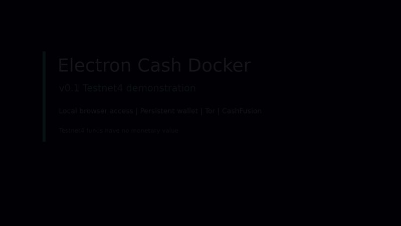

# Electron Cash Docker

Electron Cash Docker packages [Electron Cash](https://github.com/Electron-Cash/Electron-Cash),
the Bitcoin Cash SPV wallet, for a local browser through noVNC. It includes
persistent wallet data, Tor networking, and a default-enabled CashFusion plugin
with opt-in automatic fusion.

## Current v0.1 Scope

`v0.1` is the current project version. It provides local browser access,
persistent Electron Cash data, Tor for SPV traffic, the default-enabled
CashFusion plugin with opt-in auto-fusion, and a test-only testnet4 override.

Electron Cash Docker is developed as an independent open-source project.
Planned features are organized by release and are not part of `v0.1`.

## v0.1 Demo



This demonstration uses testnet4, whose funds have no monetary value. It shows
the real Electron Cash interface, two confirmed test transactions, SPV traffic
configured through Tor, the CashFusion plugin enabled and configured for Tor
with automatic fusion remaining opt-in, and wallet data persisting across a
container restart. No live CashFusion round was performed.

## Quick Start

Requirements:

- Docker Engine 20.10 or newer.
- Docker Compose v2.
- At least 2 GB of available memory.
- Approximately 2 GB of disk space for the image.

```bash
git clone https://github.com/bchforge/electron-cash-docker.git
cd electron-cash-docker
cp .env.example .env
docker compose build
docker compose up -d
```

Open <http://127.0.0.1:6080/>. The first start opens Electron Cash's wallet
setup wizard. Docker Compose creates the named volume
`bchforge-electron-cash-data` automatically. It is mounted at
`/home/electroncash/.electron-cash` and survives container restarts and normal
`docker compose down` operations. On first use the container adds a
`.electron-cash-docker` marker after checking the empty volume. Later starts
reject invalid markers, symbolic links, incompatible ownership, and ineffective
access instead of changing existing data recursively.

### Volume Management

List and inspect the data volume with ordinary Docker commands:

```bash
docker volume ls --filter name=bchforge-electron-cash
docker volume inspect bchforge-electron-cash-data
```

Docker Desktop users can open **Volumes**, select
`bchforge-electron-cash-data`, and browse its files. To inspect files without
writing to the volume, stop the stack and use a read-only helper:

```bash
docker compose down
docker run --rm --read-only --network none --cap-drop=ALL \
  --user 10001:10001 \
  --mount type=volume,src=bchforge-electron-cash-data,dst=/data,readonly \
  --entrypoint /bin/bash electron-cash:4.4.5 \
  -c 'find /data -maxdepth 3 -print'
```

Do not edit live Electron Cash files while the application is running. Do not
use Docker's internal paths such as `/var/lib/docker/volumes` as a normal
management method.

To intentionally erase all wallet data, stop the stack first and remove the
volume explicitly:

```bash
docker compose down
docker volume rm bchforge-electron-cash-data
```

Volume deletion is permanent. `docker compose down -v` also removes this
Compose-managed volume, so it must not be used casually. Keep the recovery seed
independently; persistence is not a backup. Encrypted manual backup and tested
restoration remain planned for `v0.3`.

## Tor And CashFusion

Electron Cash routes SPV traffic through the internal `tor-proxy` service by
default.

The CashFusion plugin is enabled by default and preconfigured to use Tor.
Automatic background fusion remains disabled until explicitly enabled:

```bash
CASHFUSION_AUTO_FUSE=true docker compose up -d
```

`CASHFUSION_ENABLED=false` disables the plugin entirely. If auto-fuse is true
while the plugin is disabled, the auto-fuse setting is ignored. For a normal
encrypted wallet, Electron Cash requests its password through the GUI before
background fusions can start. The environment-password exception is limited to
the automated testnet4 path described above.

The deployment values are reapplied when the container starts. While the plugin
is enabled, `CASHFUSION_AUTO_FUSE` is applied as each eligible wallet opens and
can override that wallet's previous GUI auto-fusion choice.

Enabling auto-fuse means Electron Cash will attempt eligible fusion rounds. It
does not guarantee completed rounds, privacy against every threat, or the
availability of compatible servers.

## Operation And Development

Use the standard Compose lifecycle commands from the repository root:

```bash
docker compose config
docker compose build
docker compose up -d
docker compose ps
docker compose logs -f electron-cash
docker compose down
```

The Electron Cash and noVNC versions in `.env` have matching commit and archive
integrity pins. Update each version and all of its pins together. The Ubuntu and
Tor images are also pinned by digest so builds do not silently consume a
different image under the same tag.

After building the image, run the CashFusion state matrix with:

```bash
python3 tests/test_cashfusion_states.py
```

The current `v0.1` baseline is intentionally limited to the capabilities listed
above. Future capabilities belong to their corresponding roadmap release and
are added in order: `v0.2`, `v0.3`, `v0.4`, then `v1.0`.

Source code and current project documentation are maintained in English.
English and Spanish setup and security documentation is planned for `v1.0`.

## Security Warnings

- The noVNC port binds to `127.0.0.1` by default.
- `v0.1` provides no authentication or project-provided TLS for noVNC. Do not
  publish the port or change `NOVNC_BIND` to a non-loopback address.
- A direct public noVNC mapping is outside the supported security model. HTTPS
  and Basic Auth are planned for `v0.3`.
- Set a wallet password inside Electron Cash before using meaningful funds.
- Keep the recovery seed offline and never put a real seed in `.env`.
- A compromised Docker host can read the Docker-managed wallet volume.
- Persistence is not a backup. A project-managed encrypted backup and tested
  restoration are planned for `v0.3`.
- Tor protects the configured Electron Cash network traffic, not the browser,
  host, or every application on the machine.
- In `v0.1`, the internal passwordless VNC endpoint shares a Docker network with
  the bundled Tor proxy. Attach no additional containers to that network.
  Isolating internal GUI services is planned as part of `v1.0` hardening.
- `v0.1` does not provide headless mode, JSON-RPC, X11/XQuartz, an external
  plugin distribution system, additional bundled plugins, or hardware-wallet
  passthrough.

## Testnet4 Testing

The normal setup uses mainnet. For no-funds testing, stop the current stack and
start the testnet4 override:

```bash
docker compose down
docker compose -f docker-compose.yml \
  -f docker-compose.testnet4.yml up -d
```

The override starts Electron Cash with the `--testnet4` flag. With the default
Docker-managed volume, testnet4 data is kept under the internal
`/home/electroncash/.electron-cash/testnet4` directory. Mainnet data remains at
the volume root. Stop the current stack before switching between mainnet and
testnet4 because both paths use the same data volume. Do not use this
environment for real funds.

For an automated encrypted test wallet, use the testnet4-only variables:

```bash
WALLET_AUTO_CREATE=true \
TEST_WALLET_PASSWORD=cashfusion-test-password \
CASHFUSION_AUTO_FUSE=true \
docker compose -f docker-compose.yml \
  -f docker-compose.testnet4.yml up -d
```

The generated seed is suppressed from container logs. Mainnet rejects
`WALLET_AUTO_CREATE=true` and any non-empty `TEST_WALLET_PASSWORD`.
`TEST_WALLET_PASSWORD` is intentionally read from the environment only for this
automated testnet4 path and must never contain a production wallet password.
`CASHFUSION_AUTO_FUSE` is a general CashFusion control and is not restricted to
testnet4.

## Release Roadmap

Only `v0.1` is the current baseline. The unchecked releases are planned future
project versions:

- [x] `v0.1`: browser access, persistent wallet data, Tor, the CashFusion plugin
  with opt-in auto-fusion, and a test-only testnet4 override.
- [ ] `v0.2`: secure plugin distribution, Flipstarter Helper, headless mode, and
  optional password-authenticated JSON-RPC disabled by default.
- [ ] `v0.3`: HTTPS, Basic Auth, fail2ban, additional CashFusion defaults for
  target amount, fee budget, and minimum UTXO, plus encrypted backup and tested
  restoration.
- [ ] `v0.4`: native X11 on the validated Linux path, XQuartz on the validated
  macOS path, every network supported by the pinned Electron Cash version with
  isolated data, and Ledger on native Linux Docker Engine.
- [ ] `v1.0`: hardening, including internal GUI service isolation,
  interface-language selection, maintainer-run security validation,
  documentation of the built-in noVNC virtual keyboard, English and Spanish
  setup and security documentation, expanded browser, arm64, and integration
  tests, demo, release evidence, and final accountability report.

## License

MIT. See [LICENSE](LICENSE).
